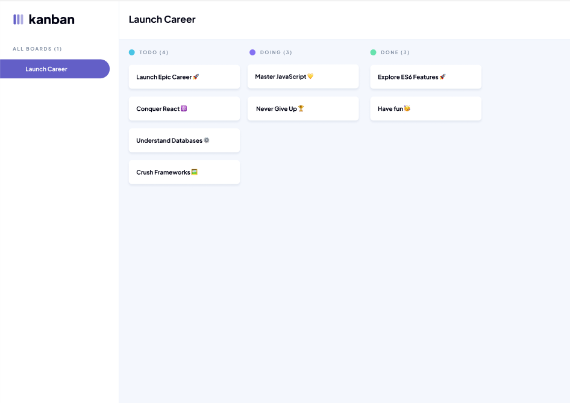
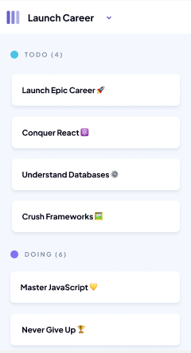

# 🗂️ Kanban Task Management App

## 🚀 Project Overview

**Kanban Task Management App** is a responsive web-based application that helps users visually organize and track their tasks through three workflow stages: `TODO`, `DOING`, and `DONE`. The app features a clean, modern UI and uses interactive browser prompts to gather task data, making it simple and intuitive to get started.

## 🛠️ Technologies Used

- 
- 
- 
- **Google Fonts** – Plus Jakarta Sans for modern typography
- **Favicon Assets** – SVG-based icons for branding

## ✨ Features

- ✅ Fully responsive Kanban board with three workflow columns
- ✅ Sidebar with custom branding and navigation layout
- ✅ Prompt-based entry of two tasks: title, description, and status
- ✅ Accepts status input in any case (`TODO`, `Doing`, `DONE`, etc.)
- ✅ Alerts and re-prompts for invalid statuses until corrected
- ✅ Separate variable storage for both tasks
- ✅ Console displays only tasks marked `"done"`
- ✅ Friendly message if no tasks are completed
- ✅ Clean, semantic, and well-commented codebase

## 📁 File Structure

```
JSL02-2025-main/
├── index.html         # Main HTML file
├── styles.css         # CSS for layout and responsive design
├── scripts.js         # JavaScript task logic and interactions
├── assets/            # Logos, icons, and screenshots
└── README.md          # Project documentation
```

## 📸 Screenshots

### 💻 Desktop View



### 📱 Mobile View



## ⚙️ Setup Instructions

1. **Clone the Repository**:

   ```bash
   git clone https://github.com/VanessaDa/VANBAA25089_PTO2502_GroupA_VanessaBaart_JSL02-2025.git
   ```

2. **Navigate into the Project Directory**:

   ```bash
   cd VANBAA25089_PTO2502_GroupA_VanessaBaart_JSL02-2025
   ```

3. **Launch the App**:
   - Open `index.html` in your browser manually, **or**
   - Use a Live Server extension in your code editor for auto-refresh

💡 _No installation or dependencies required – everything runs in the browser._

## 🧑‍💻 Usage Instructions

### 🟢 On Initial Load

1. Open the application in your browser.
2. Two browser prompts will appear asking for task details.

### 📝 Entering a Task (Twice)

Each task prompt will ask for:

- A **title** (e.g., `"Fix login issue"`)
- A **description** (e.g., `"Bug in production login flow"`)
- A **status**:
  - Valid options: `todo`, `doing`, `done` (case-insensitive)
  - Invalid inputs will trigger an alert and re-prompt

### 🖥️ Console Output

- If any task is marked `"done"`, its title and status will be printed:

  ```
  Title: "Write report", Status: "done"
  ```

- If no tasks are completed, you'll see:

  ```
  No tasks completed, let's get to work!
  ```

## 📌 Usage Examples

### ✅ Example: One Task Done

**Input via Prompt:**

- Task 1:
  - Title: `Write report`
  - Description: `Quarterly summary`
  - Status: `DONE`
- Task 2:
  - Title: `Fix navbar`
  - Description: `Issue in mobile view`
  - Status: `todo`

**Console Output:**

```
Title: "Write report", Status: "done"
```

---

### ❌ Example: No Tasks Done

**Input via Prompt:**

- Task 1:
  - Title: `Update fonts`
  - Status: `TODO`
- Task 2:
  - Title: `Test animation`
  - Status: `DOING`

**Console Output:**

```
No tasks completed, let's get to work!
```

## 💡 Future Improvements

- Replace prompts with form-based UI for better user experience
- Add drag-and-drop functionality for tasks
- Store tasks using LocalStorage or a database
- Enable task editing and deletion
- Add a dark mode toggle

## ✍️ Author

**Vanessa Baart**  
🔗 [GitHub Repository](https://github.com/VanessaDa/VANBAA25089_PTO2502_GroupA_VanessaBaart_JSL02-2025)

## 📄 License

This project is provided for **educational use only**.  
© 2025 Vanessa Baart. All rights reserved.
